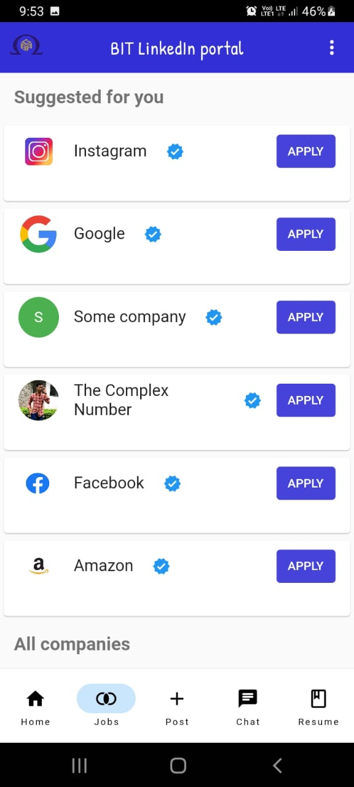

# BIT LinkedIn Portal

BIT LinkedIn Portal is an app that connects students and companies of Bannari Amman Institute of Technology (BIT). It allows users to create profiles, post updates, chat with others, find companies based on their interests, and generate resumes. It is made with Flutter framework and Firebase backend.

## Features

- Login and sign up pages with Firebase authentication
- Companies can create accounts and get verified with a blue tick
- Students can create accounts without a blue tick
- Home page where users can see posts from other users
- Suggest page where users can see companies based on their interests
- Post page where users can create posts with text, image
- Chat page where users can chat with other users (UI only without backend)
- Resume page where users can generate their resumes by filling a form and choosing a template
- About BIT page where users can learn more about the college
- BIT Placement Cell page where users can see the placement statistics and details of the college
- Profile page where users can edit their profile photo and credentials

## Installation

You can install the APK file on your Android device by following these steps: https://www.wikihow.com/Install-APK-Files-on-Android

## Usage

When you open the app, you will see a login page where you can enter your email and password to log in. If you don't have an account, you can tap on the sign up button to create one. You will need to enter your name, email, password, role (student or company), and interests.

After logging in, you will see a bottom navigation bar with five icons. You can tap on any icon to navigate to different pages of the app.

The first icon is for the home page, where you can see posts from other users. You can scroll through the posts. You can also tap on any user's profile photo to see their profile page.

The second icon is for the suggest page, where you can see companies based on your interests and preferences. You can also tap on any company to see their profile page.

The third icon is for the post page, where you can create posts with text, image. You can also add a caption to your post and tap on the post button to post it.

The fourth icon is for the chat page, where you can chat with other users. You can tap on any user's name to start a conversation with them. You can also send text messages and emojis. However, this feature is not fully functional as it does not have a backend.

The fifth icon is for the resume page, where you can generate your resumes by filling a form and choosing a template. You can enter your personal details, education details, work experience details, skills details, and achievements details. You can also choose from four templates for your resume. After filling the form and choosing a template, you can tap on the generate button to save your resume.

The app also has a drawer menu that you can access by tapping on the more icon on the top right corner of any page. The drawer menu has four options: About BIT, BIT Placement Cell, Profile, and Report to Admin.

The About BIT option will take you to a page where you can learn more about the college and its history.

The BIT Placement Cell option will take you to a page where you can see the placement statistics and details of the college. 

The Profile option will take you to your profile page, where you can edit your profile photo and credentials. You can tap on the edit icon to change your photo or any of your details. You can also see your posts, likes, and comments on your profile page.

The Logout option will log you out of the app.

## Screenshots

